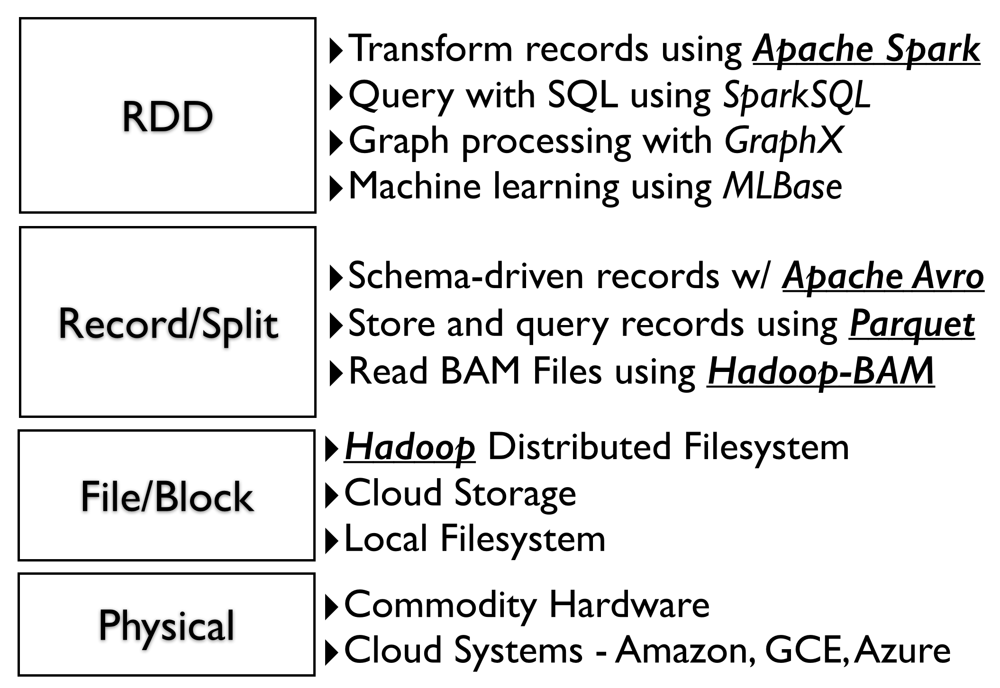
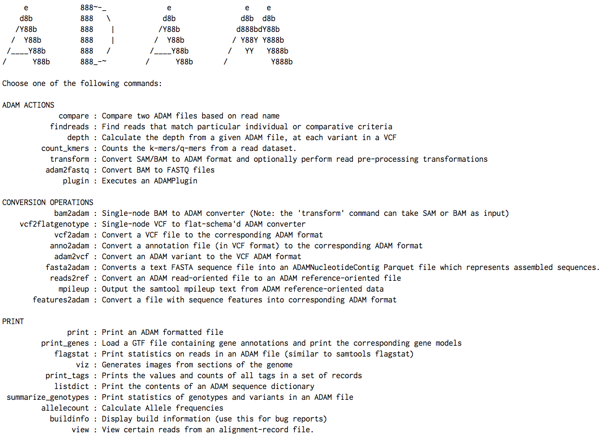
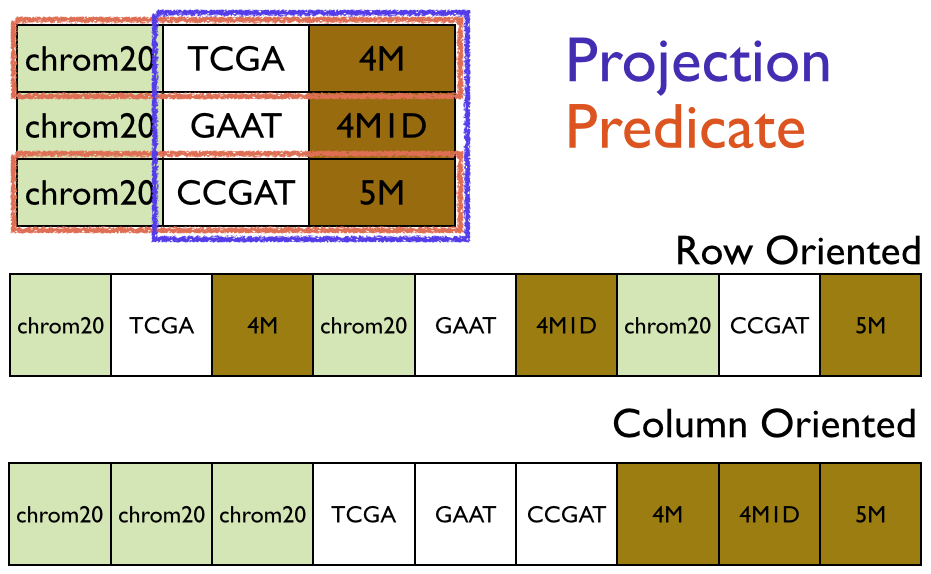
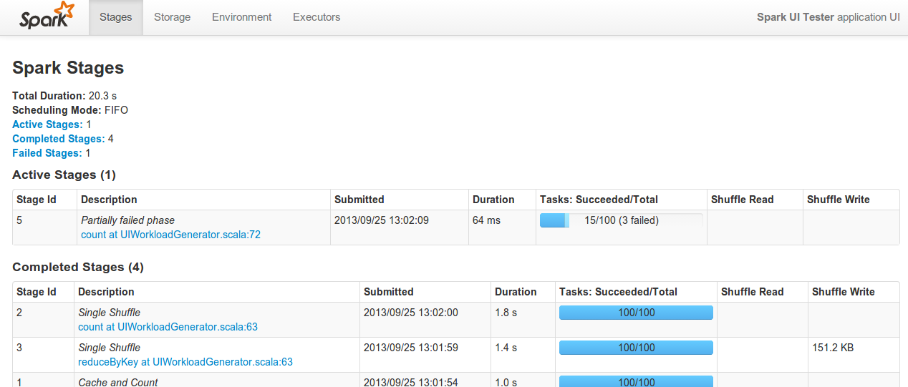
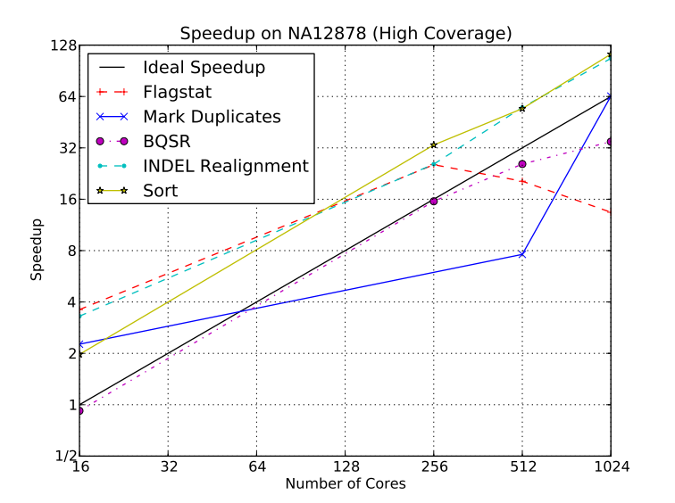

% ADAM Design Specification
% Matt Massie
% December 18, 2014

# Introduction

ADAM is a genome analysis platform built using Apache [Hadoop](http://hadoop.apache.org), [Spark](http://spark.apache.org), [Parquet](http://parquet.io) and [Avro](http://avro.apache.org). All software that ADAM requires is licensed under Apache 2.0 and ADAM itself is shared with a permissive Apache 2.0 license.

These systems provide many benefits when used together.

* Spark allows developers to focus on algorithms without needing to worry about distributed systems failures, data locality, on-disk formats, etc.,
* Spark enable jobs to be run locally on a single machine, on an in-house cluster or in the cloud *without modifications*,
* Parquet compresss legacy genomic formats using standard columnar techniques (e.g. RLE, dictionary encoding) and provide predicate pushdown and projection for performance,
* Avro and Parquet provide an agile way of customizing and evolving data formats over time,
* Spark and Hadoop are designed to scale linearly on commodity hardware,
* All systems are shared with a standard Apache 2.0 license.

Here's a sample snippet of code to count *k*-mers using ADAM, e.g.

```scala
// Load reads from 'inputPath' into an RDD for analysis
val adamRecords: RDD[AlignmentRecord] = sc.loadAlignments(args.inputPath,
  // Filter out all low quality reads that failed vendor quality checks
  predicate = Some(classOf[HighQualityReadsPredicate]),
  // Only materialize the 'sequence' from each record
  projection = Some(Projection(AlignmentRecordField.sequence)))

// The length of kmers we want to count
val kmerLength = 21

// Process the reads into an RDD of tuples with kmers and counts
val kmers: RDD[(String, Long)] = adamRecords.flatMap(read => {
  read.getSequence
    .toString
    .sliding(kmerLength)
    .map(k => (k, 1L))
}).reduceByKey { case (a, b) => a + b}

// Print the kmers as a text file to the 'outputPath'
kmers.map { case (kmer, count) => s"$count,$kmer"}
  .saveAsTextFile(args.outputPath)
```

When run on sample `NA21144`, chromosome 11 from the 1000 Genomes project, this job outputs:

```
AAAAAAAAAAAAAAAAAAAAAA, 124069
TTTTTTTTTTTTTTTTTTTTTT, 120590
ACACACACACACACACACACAC, 41528
GTGTGTGTGTGTGTGTGTGTGT, 40905
CACACACACACACACACACACA, 40795
TGTGTGTGTGTGTGTGTGTGTG, 40329
TAATCCCAGCACTTTGGGAGGC, 32122
TGTAATCCCAGCACTTTGGGAG, 31206
CTGTAATCCCAGCACTTTGGGA, 30809
GCCTCCCAAAGTGCTGGGATTA, 30716
TCCCAAAGTGCTGGGATTACAG, 30420
GTAATCCCAGCACTTTGGGAGG, 30253
CTCCCAAAGTGCTGGGATTACA, 30184
CCTGTAATCCCAGCACTTTGGG, 29157
...
```

This snippet provides a simple example which highlights the features high-level features of ADAM. ADAM implicitly converts a Spark context, `sc` in this case, into an `ADAMContext` which include the `adamLoad` method which takes an optional Parquet predicate and projection. The `inputPath` can be a single file or a file set.

The `HighQualityReadsPredicate` predicate (not shown) is a simple class is passed a record and returns a `boolean`. If the return value is `false`, the record is ignored. Only the record fields needed by the predicate are materialized for performance, e.g. if the predicate looked at aligned read flags, only the flags are materialized.

The projection defines the exact fields that the analysis needs to load into an `RDD`. In the case of this example, we only need the `sequence` from each record to count kmers. Parquet will only deserialize the sequence data and quickly skip over all other fields. Serialization/deserialization is an expense step so this dramatically helps performance and reduced the size of records in memory.

In Spark, an `RDD` is a resilient distributed dataset. You can think of it as an array of records distributed across your entire cluster. An `RDD` has a number of operations, e.g. `flatMap`, `reduceByKey`, which return a new `RDD` with new records. In this example, the `adamRecords` `RDD` is converted into the `kmers` `RDD` comprised of a tuple with each *k*-mer and the number of times it was seen.

Finally, an `RDD` has operators for saving records from an `RDD` back to an underlying file system e.g. `s3`, `HDFS` or local. 

Once compiled, this code can be run on a laptop, a cluster of machines on Amazon's EC2, Google's Cloud or Microsoft Azure without modification. It can also read from a variety of file systems, e.g. `file://`, `hdfs://`, `s3://`, `ftp://`, without modification. Spark can load data from any data source which provides a Hadoop `InputFormat` which makes integration with legacy or custom storage systems possible.

# Assumptions/ Constraints/ Standards

Parquet data can be accessed by Java and C. Since ADAM is written in Scala, we haven't done much testing of the C support. However, the C library used by Cloudera to read Parquet into Impala is open-source and broadly used and mature. We assume that multi-language support will be straightforward but that is just an assumption.

There is also an assumption that the people deploying ADAM are experienced at devops and that the people writing new methods are experienced with big data systems. Over time, we hope to provide better documentation and utilities to help less experienced users. Misconfiguration is a problem with distributed systems in general and ADAM is not an exception, e.g. block size mismatch between `HDFS` filesystem and `Parquet` files increases data movement at shuffle.

# System Design

The ADAM design emphasizes separation of concerns and clean interfaces between layers allowing users maximum flexibility at deployment. For example, ADAM supports both Hadoop 1.x and Hadoop 2.x and runs on Amazon, Google and Microsoft clouds without needing to modify code. The physical and block layers can be changed without affecting the layers above.



The system is designed to use standard open-source interfaces that exist in the Hadoop ecosystem, e.g. Hadoop `InputFormat`, Hadoop `OutputFormat`, Spark `RDD`, as well as open data standards such a Parquet and Avro. This design prevents "lock-in" and allows the system to be deployed on any cloud vendor. We publish the schemas for all ADAM objects [on github](https://github.com/bigdatagenomics/bdg-formats/blob/master/src/main/resources/avro/bdg.avdl) in [Avro IDL](http://avro.apache.org/docs/1.7.5/idl.html) format. This interface description language (IDL) can generate code for a number of different programming languages. Avro and Parquet also provide features that make it easy to change schemas while maintaining backward compatibility.

This approach has been adopted by The Global Alliance for Genomics and Health. All biological data and methods are described in [Avro IDL](http://avro.apache.org/docs/1.7.5/idl.html) at in the [schemas repository](https://github.com/ga4gh/schemas) of the GA4GH github account.

Parquet was chosen as a storage format because it allows access to the data *outside* of ADAM. Additionally, Parquet is simply a file format which makes it easy to use utilities like `rsync` and `distcp` in Hadoop to synchronize data between filesystems. Once ADAM has converted legacy data into Parquet, it is available to any system that can read from a Hadoop `InputFormat` since Parquet provides a `ParquetInputFormat` implementation. It should be noted that an `InputFormat` is simply an iterator pattern for fetching records from a data source. Parquet also provides code customized for systems like Apache [Pig](http://pig.apache.org/), [Hive](http://hive.apache.org), [Scrooge](http://twitter.github.io/scrooge/), etc which provides feature beyond iterating over records.

This openness allows users to access ADAM data as a graph, a SQL table (using e.g. Impala or SparkSQL), an `RDD` of in-memory records and use the built-in machine learning in Spark, `MLlib`.  Users are not locked into a specific framework for analysis and can use their favorite environment for processing ADAM data.

The [Google Dataflow](https://github.com/GoogleCloudPlatform/DataflowJavaSDK) JavaSDK is an implementation of the `FlumeJava` [API](http://pages.cs.wisc.edu/~akella/CS838/F12/838-CloudPapers/FlumeJava.pdf) which currently only runs on data in the Google Cloud. Any alternative Apache-licensed implementation of `FlumeJava` is [Apache Crunch](http://crunch.apache.org) which supports building workflows in-memory (on a single node), on Hadoop MapReduce or Apache Spark. It would be possible to run ADAM as part of an Apache Crunch workflow.

There are also more details about the ADAM design in the Berkeley tech report [ADAM: Genomics Formats and Processing Patterns for Cloud Scale Computing](http://www.eecs.berkeley.edu/Pubs/TechRpts/2013/EECS-2013-207.pdf).

## Use-Cases

ADAM provides a platform for biological data analysis as well as a `CLI` for basic operations (see Figure 2 below). There are commands for comparing files, finding reads, calculating depth, converting data, executing ADAM plugins, printing statistics, generating *k*-mer and *q*-mer counts, calculating allele counts, visualizing reads via an embedded genome browser, etc. The `transform` command does more than just convert from BAM to ADAM but also includes sorting, mark duplicates, base quality score recalibration and indel realignment pre-processing methods to convert aligned reads into analysis-ready reads. The `transform` command is Extract-Transform-Load (ETL) component of ADAM.



There are other projects that build on ADAM to provide more functionality.

* [RNAdam](https://github.com/bigdatagenomics/RNAdam) provides an RNA pipeline on top of ADAM with isoform quantification and fusion transcription detection,
* [Avocado](https://github.com/bigdatagenomics/avocado) is a variant caller built on top of ADAM for germline and somatic calling,
* [PacMin](https://github.com/bigdatagenomics/PacMin) is an assembler for PacBio reads,
* A `Mutect` port is nearly complete,
* Read error correction,
* a graphing and genome visualization library,
* [BDG-Services](https://github.com/bigdatagenomics/bdg-services) is a library for accessing a running Spark cluster through web-services or a [Thrift](https://thrift.apache.org/)-interface,
* [Short read assembly](http://www.github.com/fnothaft/xASSEMBLEx)
* Variant filtration (train model via `MLlib`)

All these project are shared using an Apache 2.0 licensed.

ADAM has also used for [*k*-means for population stratification](http://bdgenomics.org/blog/2014/11/03/lightning-fast-genomics/).

## Database Design

ADAM uses Apache [Avro](http://avro.apache.org/) and [Parquet](http://parquet.io) for serialization, storage and querying of data. All ADAM objects are explicitly defined [on github](https://github.com/bigdatagenomics/bdg-formats/blob/master/src/main/resources/avro/bdg.avdl) in [Avro IDL](http://avro.apache.org/docs/1.7.5/idl.html). The ADAM build system, Maven, uses the `avro-maven-plugin` to automatically generate Java code for the defined objects. Avro can also generate code in C++, Python, Ruby, etc.

Parquet integrates well with Avro. It converts the Avro schema into Parquet schema to store Avro objects inside of the Parquet columnar container file. Alex Holmes has [a great blog post](http://grepalex.com/2014/05/13/parquet-file-format-and-object-model/) with the details of how this integration works for Avro, Thrift and Protocol Buffers.

Parquet support pushdown predicates and schema projection to allow developers to only materialize the data they need, since (de)serialization is expensive.



In this image, you can see that predicates allow you to choose specific *rows* of a table. Note, the predicates will only deserialize the fields in the row needed for the predicate. If the predicate passes (returns `true`), then Parquet will materialize the record according the projection in effect.

A projection is can be all fields or a limited number of fields in each record. In the image above, the projection is for the `sequence` and `cigar` fields and the `referenceName` is ignored. Of the nine cells in the image, the predicate and projection together only materialize the four cells.

Parquet is column-oriented meaning that each field is storage in a contiguous area on disk. As you can see from the image above, this approach keeps similar data (e.g. `sequence` string) together which improves performance and compression. ADAM files are about 20% smaller than compressed BAM files with no loss of data. New columnar compression techniques coming in Parquet 2.0 will likely dramatically improve compression of quality scores which take about 70% of on-disk space.

## Application Program Interfaces

ADAM uses the standard `InputFormat`, `OutputFormat` and `RDD` interfaces that are widely used in the Hadoop ecosystem.

## User Interface Design

ADAM jobs can be monitored and killed using the Spark UI which by default run on port `4040` on the Spark master machine, e.g.



This UI allows users to track the progress and performance of jobs in flight including the exact line of code being run, shuffle sizes, environment variables, executor memory, etc.

[Spark Notebook](https://github.com/andypetrella/spark-notebook) provides an iPython/[Project Jupyter](http://jupyter.org/)-like, user interface to creating, launching and visualizing ADAM workflows. This workflows can be saved and shared between users. The [Spark Notebook `README`](https://github.com/andypetrella/spark-notebook) provides example of the visualization and how to integrate with ADAM.

## Performance

ADAM is built on Hadoop, Spark, Parquet and Avro. ADAM performance benefits immediately from updates to those underlying technologies. For example, [Databricks](http://databricks.com/), a Spark startup spun out the [AMPLab](https://amplab.cs.berkeley.edu/), recently announced that it [crushed the Daytona GraySort record](http://databricks.com/blog/2014/11/05/spark-officially-sets-a-new-record-in-large-scale-sorting.html) achieving a **3x** boost in performance using **10x** less machines. Moreover, Databricks used Amazon EC2 instead of bare metals machines which were used for all previous GraySort records. All the performance improvements they added to win this benchmark were folded back into the open-source implementation of Spark to benefit the community (and ADAM).



Figure 5 demonstrates how the ADAM design benefits from the horizontal scalability of Spark.

For more details about the ADAM performance, see the Berkeley tech report [ADAM: Genomics Formats and Processing Patterns for Cloud Scale Computing](http://www.eecs.berkeley.edu/Pubs/TechRpts/2013/EECS-2013-207.pdf).

It should be noted that performance is influenced by the underlying block/physical layers. While ADAM can integrate with any data source, the performance will vary especially when processing is not data local.

## Technologies to Evaluate and Criteria

1. Evaluate [Apache Crunch](http://crunch.apache.org) as a workflow for ADAM to allows users to run on any cloud vendor, in-house or on a single machine.
2. Create a Hadoop `InputFormat` for some of the current data source at The Broad Institute to demonstrate ease of integration. ADAM can read from any data source that provides an `InputFormat`. 
